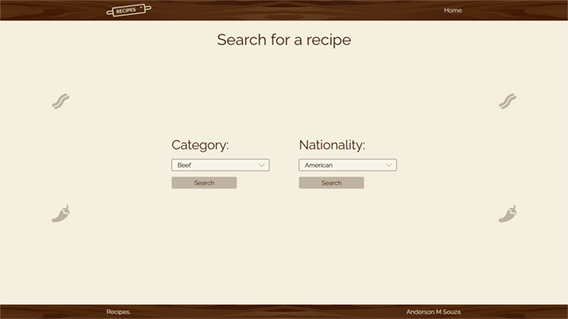
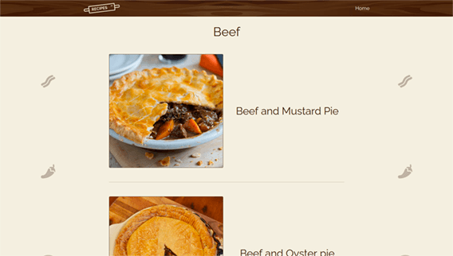
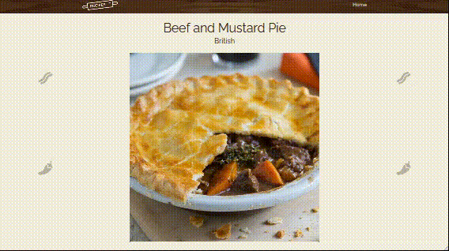

# Recipes

[english version](https://github.com/anderson-m-souza/recipes-site#readme)

Pesquisar receitas da API pública [TheMEalDB](https://www.themealdb.com/).

### Objetivo

Meu objetivo é executar todas as etapas da implementação de um site, e praticar o que estou estudando.

### Site

Fiz um site simples com apenas 3 páginas.

Na Home, há duas opções de busca, por categoria e por nacionalidade.

A listagem mostra o resuldado da pesquisa.

E a página da receita mostra todas as informações disponíveis na API. Nome do prato, nacionalidade, foto, ingredientes, modo de preparo, uma fonte, e um video.

### Tecnologias

Esse projeto está sendo desenvolvido com a arquitetura MVC, baseado na [Série | Criando Site em PHP + MVC + CRUD](https://www.youtube.com/playlist?list=PLgbAYUnxJ2NE6eM2xkOlpqJ5sl37bLyKx) de [Rafael Capoani](https://www.youtube.com/c/RafaelCapoani/featured)

A API é a [TheMealDB](https://www.themealdb.com/).

Para carregar as informações no HTML, usei a template engine para PHP [Twig](https://twig.symfony.com/).

Pretendo implementar URLs amigáveis adicionando um arquivo htaccess, mas ainda não obtive sucesso nesta etapa.

Criei um manifest e um maskable icon pra que o site pudesse ser utilizado como PWA (Progressive Web App).

No CSS, usei o grid layout, flexbox e a [Metodologia BEM (Block Element Modifier)](http://getbem.com/) para a nomeação de classes.

O layout foi feito no [Adobe Xd](https://www.adobe.com/br/products/xd.html).

Usei uma fonte do [Google Fonts](https://fonts.google.com/specimen/Raleway?preview.text_type=custom) carregada localmente.

E ícones do [Fontawesome](https://fontawesome.com/icons?d=gallery&q=food).

### Instalação

Para testar o projeto, é necessário ter um servidor local tipo XAMPP configurado. E abrir o site no localhost.