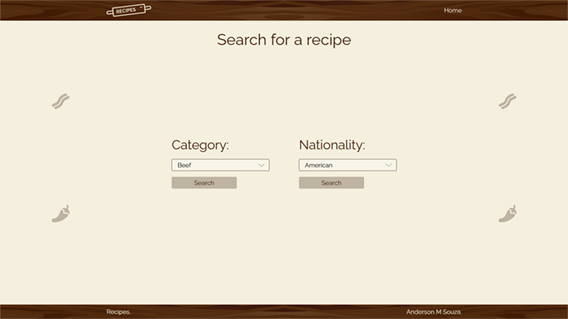
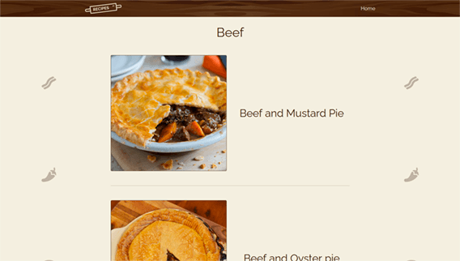

# Recipes

[versão em português](https://github.com/anderson-m-souza/recipes-site/blob/master/README-pt-br.md#readme)

Search recipes at the public API [TheMEalDB](https://www.themealdb.com/).

### Objective

My goal is to perform all the steps of implementing a website, and to practice what I've been studying.

### Site

I made a simple website with only 3 pages.

At the Home page there are two search options: by category and by nationality.

The list page shows the search result.

And the recipe page shows all the information available in the API. Name of the dish, nationality, photo, ingredients, instructions, a source, and a video.

### Technologies

I'm developing this project with the MVC architecture, based on the video series [Criando Site em PHP + MVC + CRUD](https://www.youtube.com/playlist?list=PLgbAYUnxJ2NE6eM2xkOlpqJ5sl37bLyKx) (in portuguese) by [Rafael Capoani](https://www.youtube.com/c/RafaelCapoani/featured).

The API is [TheMealDB](https://www.themealdb.com/).

To load the information in HTML, I used the template engine for PHP [Twig] (https://twig.symfony.com/).

I intend to implement friendly URLs by adding an ".htaccess" file, but I still haven't been successful in this step.

I've created a manifest and a maskable icon so that the site could be used as a PWA (Progressive Web App).

In CSS, I've used grid layout, flexbox and the [BEM (Block Element Modifier)](http://getbem.com/) methodology to name classes.

The layout was made in [Adobe Xd](https://www.adobe.com/br/products/xd.html).

I've used a [Google Fonts](https://fonts.google.com/specimen/Raleway?preview.text_type=custom) font loaded locally.

And [Fontawesome](https://fontawesome.com/icons?d=gallery&q=food) icons.

### Installation

To test the project, it is necessary to have a local server (XAMPP, WAMPP etc) configured. And open the site at the localhost.